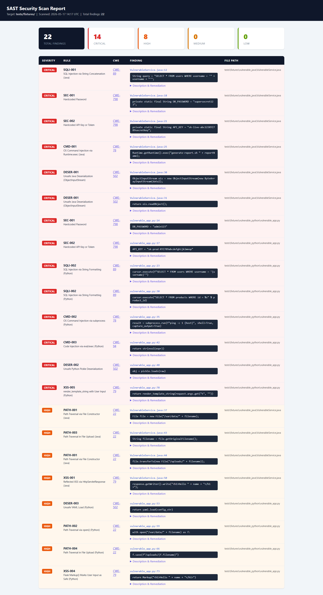

# sast-scanner-py

[](https://github.com/nicolasvl11/sast-scanner-py/actions/workflows/sast.yml)


A lightweight **Static Application Security Testing (SAST)** tool that detects security vulnerabilities in Java and Python source code. Zero external dependencies — pure Python standard library.

Findings appear inline in GitHub PRs via [GitHub Code Scanning](https://docs.github.com/en/code-security/code-scanning) (SARIF output).

---

## Demo



> HTML report with severity breakdown, CWE references, and expandable remediation guidance.

---

## Features

| Category | Rules | CWE |
|---|---|---|
| SQL Injection | String concatenation, f-strings, ORM bypass | CWE-89 |
| Hardcoded Secrets | Passwords, API keys, AWS credentials, JWT secrets, private keys | CWE-798, CWE-321 |
| Command Injection | `Runtime.exec`, `subprocess(shell=True)`, `os.system` | CWE-78 |
| Code Injection | `eval()`, `exec()`, `ScriptEngine.eval` | CWE-94 |
| Unsafe Deserialization | `ObjectInputStream`, `pickle.loads`, `yaml.load`, XStream | CWE-502 |
| Path Traversal | `new File(userInput)`, `open(request.args...)`, unsafe uploads | CWE-22 |
| XSS | `response.getWriter().write(+)`, `Markup(request.)`, `render_template_string`, `\|safe` | CWE-79 |

Findings are sorted by severity: **CRITICAL → HIGH → MEDIUM → LOW**

---

## Quick Start

### Option A — pip install
```bash
pip install git+https://github.com/nicolasvl11/sast-scanner-py.git
sast-scan ./my-project --format html --output report.html
```

### Option B — clone and run
```bash
# Clone and install
git clone https://github.com/YOUR_USERNAME/sast-scanner-py
cd sast-scanner-py
pip install -r requirements.txt

# Scan a directory (console output)
python cli.py /path/to/your/project

# Generate HTML report
python cli.py /path/to/your/project --format html --output report.html

# Generate JSON report (useful for CI/CD pipelines)
python cli.py /path/to/your/project --format json --output report.json

# Filter by minimum severity
python cli.py /path/to/your/project --severity HIGH
```

---

## Output Examples

### Console
```
SAST Scan Report — /path/to/project
────────────────────────────────────────────────────────────
✖ [CRITICAL] SQLI-001: SQL Injection via String Concatenation (Java)
  File   : VulnerableService.java:12
  CWE    : CWE-89
  Code   : String query = "SELECT * FROM users WHERE username = '" + username + "'";
  Issue  : SQL query built by concatenating user-controlled input...
  Fix    : Use PreparedStatement with parameterized queries...

  CRITICAL   3
  HIGH       4
  MEDIUM     1

  Total: 8 finding(s)
```

### HTML Report
Opens in any browser. Findings grouped by severity with expandable descriptions and remediation guidance.

### JSON Report
```json
{
  "scan_target": "/path/to/project",
  "scan_time": "2025-05-17T14:23:00Z",
  "summary": { "CRITICAL": 3, "HIGH": 4, "MEDIUM": 1, "LOW": 0 },
  "total": 8,
  "findings": [...]
}
```

---

## Architecture

```
sast-scanner-py/
├── cli.py                      # Entry point — argument parsing, output dispatch
├── scanner/
│   ├── engine.py               # File walker + rule matcher
│   ├── reporter.py             # HTML and JSON report generators
│   └── rules/
│       ├── base.py             # Rule, Finding, Severity, Language dataclasses
│       ├── sql_injection.py    # SQLI-001, SQLI-002, SQLI-003
│       ├── hardcoded_secrets.py # SEC-001 to SEC-005
│       ├── dangerous_functions.py # CMD-001 to CMD-005
│       ├── unsafe_deserialization.py # DESER-001 to DESER-005
│       └── path_traversal.py  # PATH-001 to PATH-004
└── tests/
    ├── fixtures/               # Intentionally vulnerable code for testing
    └── test_rules.py           # Rule coverage tests
```

Each rule is a simple dataclass with: ID, name, severity, CWE reference, description, remediation, and regex patterns. Adding a new rule is as simple as adding to the list in the relevant file.

---

## Running Tests

```bash
pytest tests/ -v
```

All rules are tested against intentionally vulnerable fixtures in `tests/fixtures/`.

---

## CI/CD Integration

The scanner exits with code `1` if any CRITICAL or HIGH findings are detected — making it easy to fail a pipeline:

```yaml
# GitHub Actions example
- name: SAST Scan
  run: |
    pip install -r requirements.txt
    python cli.py ./src --format json --output sast-report.json --severity HIGH

- name: Upload SAST Report
  uses: actions/upload-artifact@v4
  with:
    name: sast-report
    path: sast-report.json
```

---

## Extending the Scanner

Add a new rule in 3 steps:

1. Create (or add to) a rule file under `scanner/rules/`:
```python
Rule(
    id="XSS-001",
    name="Reflected XSS via Response Write",
    severity=Severity.HIGH,
    cwe="CWE-79",
    description="...",
    remediation="...",
    patterns=[r'response\.getWriter\(\)\.write\(.*request\.getParameter'],
    languages=[Language.JAVA],
)
```
2. Import the list into `scanner/rules/__init__.py`
3. Add a test in `tests/test_rules.py`

---

## Limitations

- Pattern-based (regex), not AST-based — may produce false positives on complex expressions
- Does not perform data-flow analysis (taint tracking)
- Designed for Java and Python; other languages require new parser mappings

---

## License

MIT
